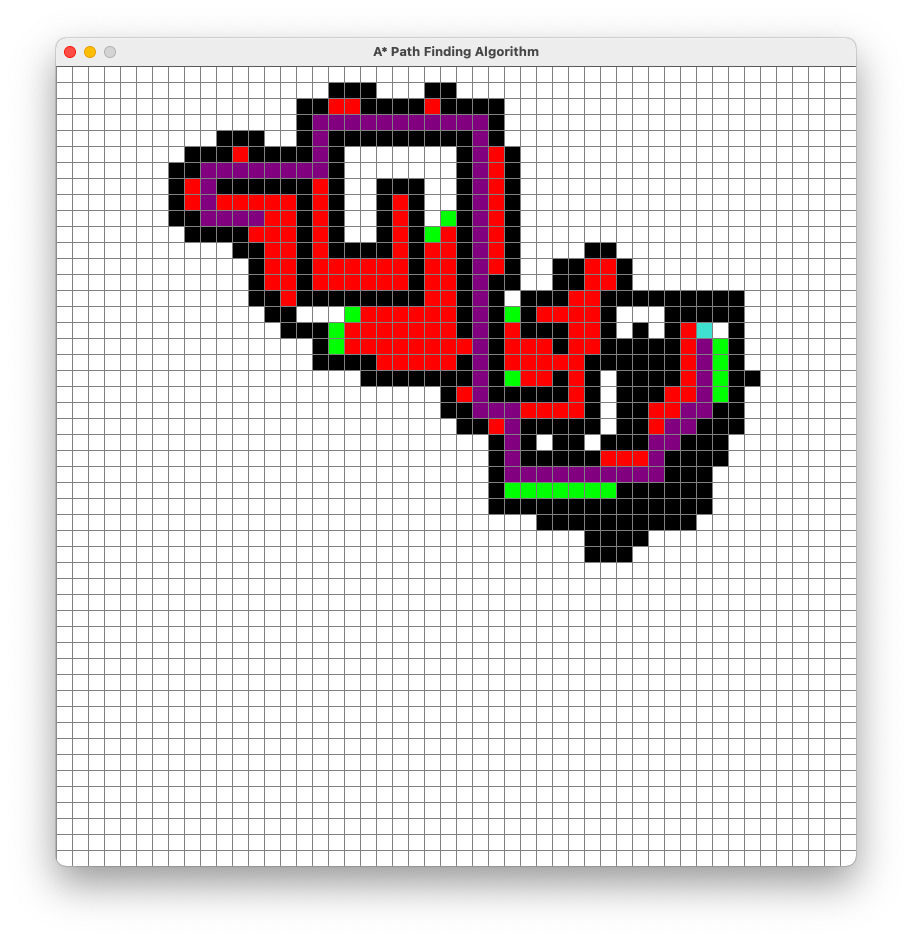

# PathPlanning
<h2>A* Algorithm </h>

It is an efficient way to trace a path in a give grid 

<h4>Key Shortcuts</h4>
<ul>Click left Mouse button to add the start point </ul>
<ul>Same for the end point </ul>
<ul>Click left mouse button and drag to add black barriers</ul>
<ul>Click Right mouse button and drag to delete black barriers</ul>
<ul>Press Space Bar to start the algorithm</ul>
<ul>Press c to reset the whole</ul>